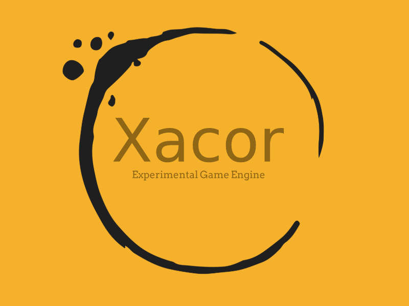

# Xacor
  

Xacor an experimental game-engine. This is a purly educational project for learning and experimental purposes.
The goal is to provide a fully abstracted engine, which can run on various backends such as

- [D3D11](Xacor.Graphics.DX11/README.md)
- [OpenGL 4.6](Xacor.Graphics.GL46/README.md)
- [OpenGL 3.3](Xacor.Graphics.GL33/README.md)

- [D3D12](Xacor.Graphics.DX12/README.md)
- [Vulkan](Xacor.Graphics.VK/README.md)

At the moment `D3D11` and `OpenGL 4.6` are the most complete backends.
